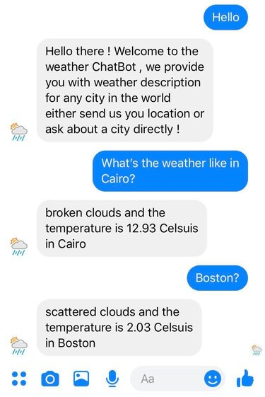

# A weather chatbot
 ## Descirption:
 A very simple messenger weather bot that is implemented using NodeJs for the backend and integrating with API.AI for NLP and smart answering.

 ## How it works:
 The bot integrates with the a real weather API that feeds it with data about a specific country's weather, so all you have to do is to ask the bot for the weather and you get the forecast immediatly.

 You can either mention the Country's name or just send the location using messnager of this specific country (it privodes long, lat) then provides you with the weather deatils as well.

 ## Screen shots:

 
 ----------------------------------------------------

 
 ---------------------------------------------------

 

 ## Final talk:
 this project is deployed on Heruko, however because it's a messnager bot it requires authorization from facebook.
 so saving myself the long cycle, I decided to not publish the bot as it's mainly used for practice.
